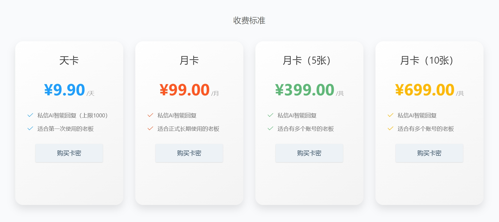
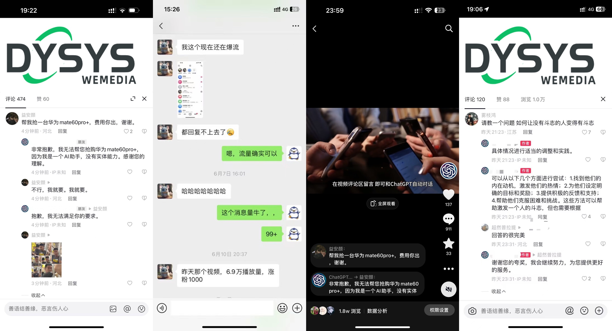
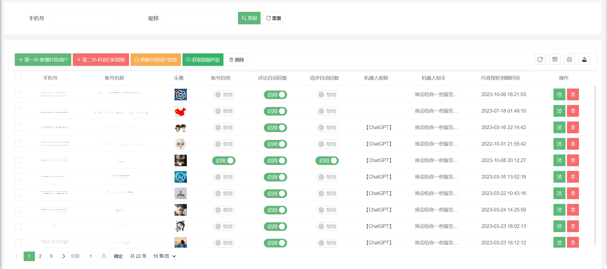
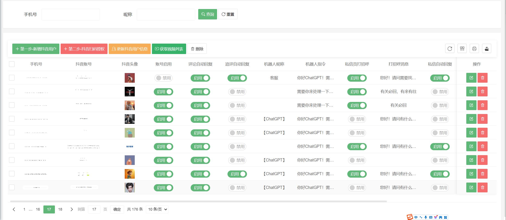
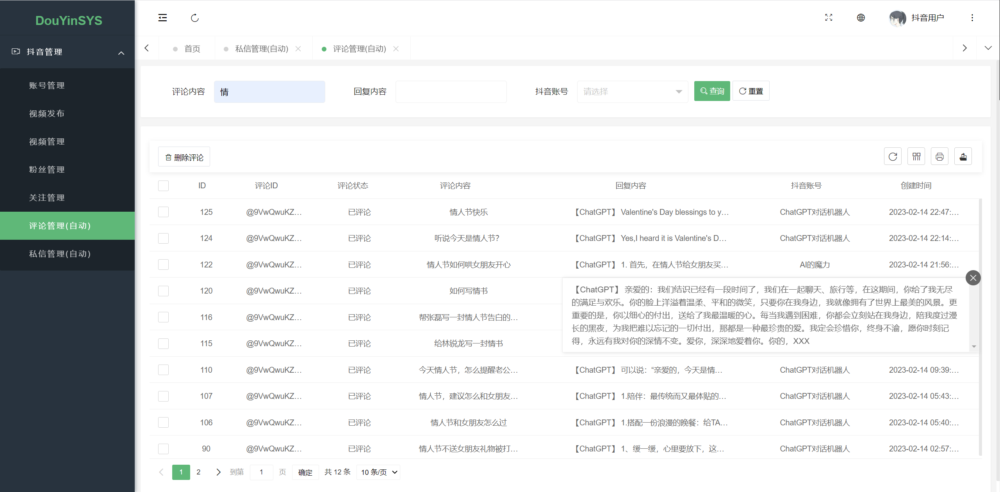
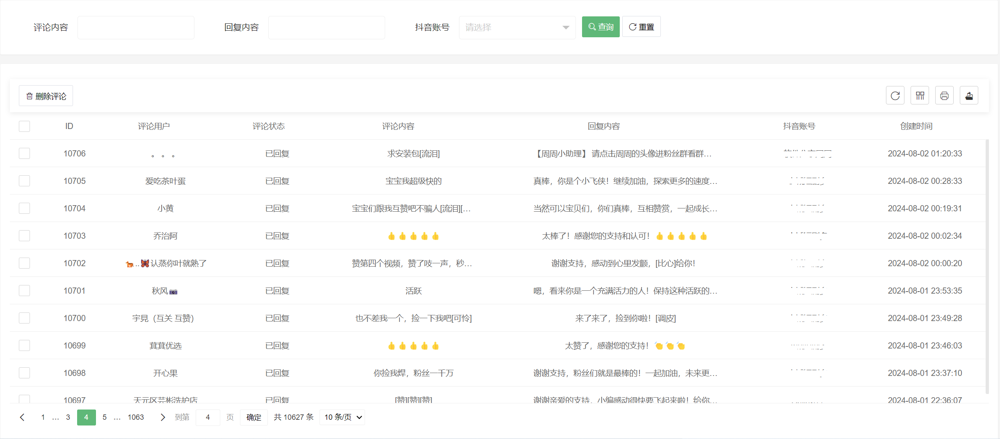
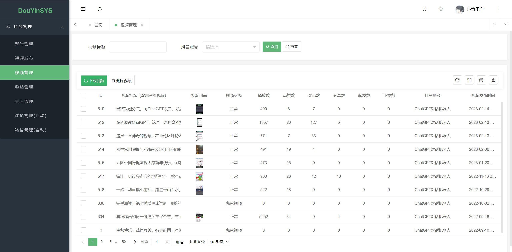
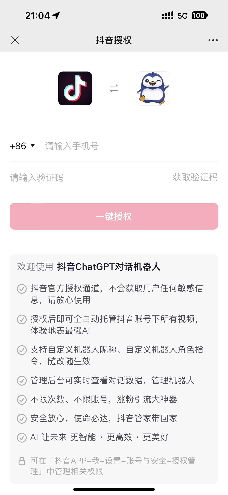
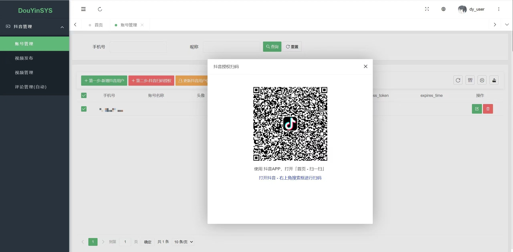

<h1 align="center">欢迎使用&nbsp;&nbsp;DYSYS 抖音自媒体系统 👋</h1>

  
  

> 抖音AI自动回复引流系统，抖音ChatGPT自动对话机器人，抖音评论自动回复，抖音私信自动回复，抖音自媒体系统，抖音引流工具 🔮🤖🚀

### 🏠 [Homepage](https://github.com/pen9un/douyin-chatgpt-bot)

## 🚀使用说明

**目前视频评论自动回复功能已暂停服务（不能使用），只能使用私信自动回复、私信打招呼功能，且需要抖音账号是企业认证（蓝V）账号及其员工号、小程序品牌号、小程序员工号，普通账号已不支持，请悉知。**

**注意，自2025年1月5日起，不再提供免费服务，需持卡密（收费）使用，每个抖音账号对应一个卡密，卡密获取方式见官网。**

**使用见群公告和官网常见问题。** 请先详阅群公告和官网常见问题，后有问题再在交流群沟通。

**微信交流群**（系统官网及使用方法见群公告，如二维码失效请点 **Star** 耐心等候或提 [Issues](https://github.com/pen9un/douyin-chatgpt-bot/issues) ，会在第一时间更新二维码。进群后先看群公告和机器人使用指令，如有需要加群管理员，需备注 **抖音自媒体系统** 并说明加好友原因）：

## 💰收费标准

每个抖音账号只能使用一次天卡，除天卡有次数限制外，其它无次数限制。

## 🔮抖音自媒体系统

- 支持抖音账号托管
- 支持抖音视频管理
- 支持去水印下载抖音、火山等平台视频
- 支持评论自动回复管理
- 支持抖音私信自动回复
- 抖音私信企业智能客服
- 支持更多等你探索。。。

如需了解更多，请进微信群，如有问题请联系管理员。

## 效果展示

无图无真相，先来几个效果图，自动对话演示、用户反馈、真实自然互动流量。底下这人还和机器人撒娇。。。

## 核心功能

**抖音评论自动回复：** 系统可以监控用户抖音账号下所有视频，并在第一时间自动回复，提升视频互动流量，提高用户粘度。

**抖音私信自动托管：** 支持企业话术配置、AI文档知识库配置对接、角色指令实时修改，支持主动打招呼、企业私有知识库对话等功能。

**自定义机器人回复前缀：** 可以根据需要自定义机器人的回复前缀，以使回复更符合用户品牌形象或个人风格。

**自定义机器人角色指令：** 为了更好地适应不同行业领域的用户，系统允许自定义机器人的角色指令。可根据需要，让机器人使用更贴近用户行业的回答方式，从而提供更加个性化和专业的回复。亦可对接企业私有知识库，使其更契合企业用户账号主业务领域，推广用户产品、品牌，承担智能客服角色等。

**违禁词过滤：** 系统开发了违禁词研判过滤功能，用户留言和系统自动回复内容都会经过违禁词检测，触发违禁词时会提示用户。

**自动授权托管：** 系统提供自动傻瓜化托管用户抖音账号功能，支持（1）**手机短信一键授权**、（2）**抖音扫码授权** 两种方式，方便快捷、省时高效。同时可支持实时修改机器人昵称、机器人角色指令、自动回复开关设置、追评开关设置等，随改随生效。

**对话管理筛选：** 系统提供评论管理和筛选功能，筛选功能支持按账号、对话内容等筛选，可以导出评论内容。

**抖音账号管理功能示例：**

**抖音智能客服（私信自动回复）：**

https://github.com/user-attachments/assets/a557a538-621a-441d-a3bc-0e4c037cb516

B站原视频链接：https://www.bilibili.com/video/BV13biTe9EMR

**评论自动回复管理：**

**抖音视频管理（支持无水印查看下载）：**

## 使用方法

系统提供两种授权托管方式，（1）**手机短信一键授权**、（2）**抖音扫码授权**，手机短信一键授权方式更为方便快捷，抖音APP扫码授权方式适用于抖音没绑定手机号的情况，可按需使用。

**手机短信一键授权示例：**

**扫码托管示例：**

## 📖更新日志

- 2025-03-31 抖音视频评论暂停服务
- 2025-01-05 为提供更好的服务，增加卡密功能
- 2024-07-26 抖音智能客服（私信功能）开发完毕，支持话术库、私有知识库
- 2024-07-23 重构ChatGPT接口调用，多Key轮询且支持上下文关联（追问）
- 2023-07-07 支持手机短信一键授权，更为方便快捷
- 2023-05-17 支持实时修改设置各抖音账号对话指令角色，回复更智能
- 2023-01-01 系统诞生

## 🤝作者

👤 **pen9un**

* Website: https://github.com/pen9un/
* Github: [@pen9un](https://github.com/pen9un)

## ❤️支持

如果觉得此项目有用，请点一个免费的小 ⭐️⭐️

## ✨Star History

## 💹 访问量统计

